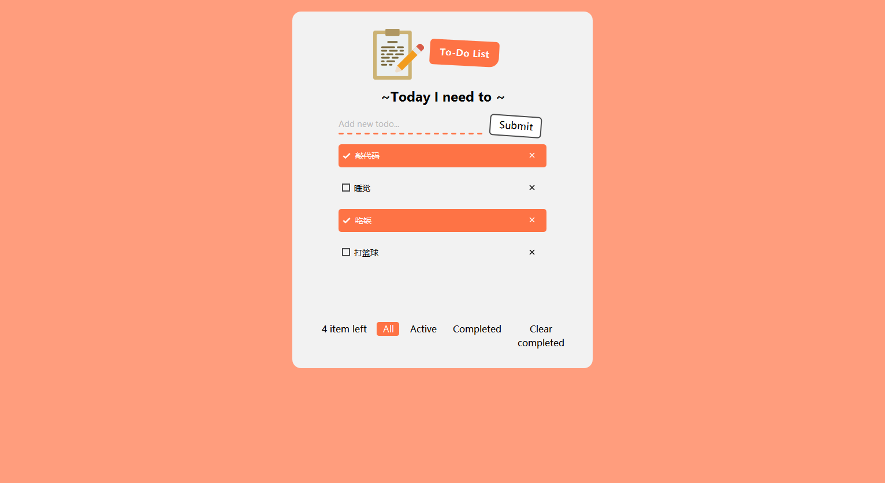

案例 TodoList 带你入门 sciter 组件化编程

> 下诉案例已基本覆盖 sciter 组件化编程所涉及到的内容，及注意细节

### 1、效果图





### 2、技术要点

* JSX 组件化编程（类组件）
* 组件间如何通信
* 组件生命周期
* 组件如何绑定事件
* 如何处理组件中 this 指向
* 模块化 CSS

### 3、如何使用

```html
<div class="container"></div>
<script type="module">
    import { TodoList } from './component/index.js';
    document.$(`.container`).content(<TodoList />);
</script>
```

### 4、组件 TodoList 源码

```javascript
export class TodoList extends Element {
    value;
    list = [];
    constructor(props) {
        super(); // 必写
    }

    // 组件挂载
    componentDidMount() { }
    
    // 组件销毁前
    componentWillUnmount() { }
    
    componentUpdate(newdata) {
        if (typeof newdata == "object") {
            Object.assign(this, newdata);
        }
        this.post(() => this.patch(this.render()));
    }

    render() {
        return (
            <div styleset={__DIR__ + "index.css#todolist"}>
                <div class="header">
                    <div class="info">To-Do List</div>
                </div>
                <div class="title">~Today I need to ~</div>
                <div class="form">
                    <div class="form-input">
                        <input type="text" placeholder="Add new todo..." value={this.value} onchange={(event) => this.value = event.target.value} />
                        <button onclick={this.submit}><span class="submit">Submit</span></button>
                    </div>
                </div>
                {this.list.length == 0 && (
                    <div class="empty-todos">
                        <svg class="icon" aria-hidden="true" focusable="false" data-prefix="fas" data-icon="clipboard-check" role="img" xmlns="http://www.w3.org/2000/svg" viewBox="0 0 384 512" data-v-132cabf7=""><path class="" fill="currentColor" d="M336 64h-80c0-35.3-28.7-64-64-64s-64 28.7-64 64H48C21.5 64 0 85.5 0 112v352c0 26.5 21.5 48 48 48h288c26.5 0 48-21.5 48-48V112c0-26.5-21.5-48-48-48zM192 40c13.3 0 24 10.7 24 24s-10.7 24-24 24-24-10.7-24-24 10.7-24 24-24zm121.2 231.8l-143 141.8c-4.7 4.7-12.3 4.6-17-.1l-82.6-83.3c-4.7-4.7-4.6-12.3.1-17L99.1 285c4.7-4.7 12.3-4.6 17 .1l46 46.4 106-105.2c4.7-4.7 12.3-4.6 17 .1l28.2 28.4c4.7 4.8 4.6 12.3-.1 17z"></path></svg>
                        <span class="todos-text">Congrat, you have no more tasks to do</span>
                    </div>
                )}
                {this.list.length != 0 && (
                    <List data={this.list}
                        finshed={this.finshed}
                        del={this.del}
                    />
                )}
            </div>
        );
    }

    // 提交
    submit = (event) => {
        const value = this.value.trim();
        if (value.length != 0) {

            this.list.unshift({
                id: Math.random(),
                text: value,
                state: false
            });

            this.componentUpdate({
                value: "",
                list: this.list
            });
        }

    }

    // 完成
    finshed = (data) => {
        const i = this.list.findIndex(item => item.id == data.id);
        if (i != -1) this.list[i].state = true;

        this.componentUpdate({ list: this.list });
    }

    // 删除
    del = (data) => {
        data.forEach(item1 => {
            const i = this.list.findIndex(item2 => item2.id == item1.id);
            this.list.splice(i, 1);
        });
        this.componentUpdate({ list: this.list });
    }
}
```

### 5、List 组件源码

```javascript
class List extends Element {
    id; // 组件 id
    Dom; // 组件 DOM

    data = [];
    
    finshed; // 回调 
    del; // 回调

    key = 'All';

    constructor(props) {
        super();
        // 生成唯一 id
        this.id = `list-${Math.ceil(Math.random() * 100)}`;

        this.data = props.data;
        this.finshed = props.finshed;
        this.del = props.del;
    }

    // 挂载前
    componentDidMount() {
        // 保存 list 组件的 Dom 元素
        this.Dom = document.querySelector(`#${this.id}`);
    }

    componentUpdate(newData) {
        if (typeof newdata == "object") {
            this.data = newData.data;
            this.key = newData.key;
        }
        this.post(() => this.patch(this.render()));
    }

    render(props, kids) {
        const activeLen = this.data.filter(item => item.state).length;
        const state = this.data.some(item => item.state);
        const len = this.data.length;
        return (
            <div styleset={__DIR__ + "index.css#list"} id={this.id}>
                <ul class="list">
                    {this.data.map(item => {
                        return (
                            /* key={Math.random()} 使其重新渲染 */
                            <li class={item.state ? 'item active' : 'item'} onclick={this.itemFinshed.bind(this, item)} tag={item.id} key={Math.random()}>
                                <i class='state-icon'></i>
                                <span class='text'>{item.text} </span>
                                <i class='close-icon' onclick={() => this.itemDel(item)}></i>
                            </li>
                        )
                    })}
                </ul>
                <div class="detail">
                    <span>{len} item left</span>
                    <span class={this.key == 'All' ? 'state-active' : ''} onclick={this.itemFilter.bind(this, 'All')}>All</span>
                    <span class={this.key == 'Active' ? 'state-active' : ''} style={(state && activeLen != len) ? '' : 'display: none'} onclick={this.itemFilter.bind(this, 'Active')}>Active</span>
                    <span class={this.key == 'Completed' ? 'state-active' : ''} style={(state && activeLen != len) ? '' : 'display: none'} onclick={this.itemFilter.bind(this, 'Completed')}>Completed</span>
                    <span class={this.key == 'Clear completed' ? 'state-active' : ''} style={state ? '' : 'display: none'} onclick={this.clearCompleted.bind(this)}>Clear completed</span>
                </div>
            </div>
        )
    }

    // 完成
    itemFinshed = (item, event) => {
        if (!event.target.classList.contains('close-icon')) {
            this.finshed && this.finshed(item);
        }
    }

    // 删除
    itemDel = (item) => {
        this.del && this.del([item]);
    }

    // 清除完成
    clearCompleted = () => {
        const completedList = this.data.filter(item => item.state);
        this.del && this.del(completedList);
    } 

    // 过滤
    itemFilter = (key) => {
        const children = this.Dom.querySelector(`.list`).children;
        const stateList = this.Dom.querySelector(`.detail`).children;

        Array.from(stateList).forEach(item => { item.classList.remove('state-active') });

        const activeList = this.data.filter(item => !item.state);
        const completedList = this.data.filter(item => item.state);

        // 手动操作 DOM
        Array.from(children).forEach(item => {
            const id = item.getAttribute('tag');

            if (key == 'All') {
                stateList[1].classList.add('state-active');
                Object.assign(item.style, { display: 'block' });
            }

            if (key == 'Active') {
                stateList[2].classList.add('state-active');
                const i = activeList.findIndex(activeItem => activeItem.id == id);
                const style = i != -1 ? { display: 'block' } : { display: 'none' };
                Object.assign(item.style, style);
            }

            if (key == 'Completed') {
                stateList[3].classList.add('state-active');
                const i = completedList.findIndex(activeItem => activeItem.id == id);
                const style = i != -1 ? { display: 'block' } : { display: 'none' };
                Object.assign(item.style, style);
            }
        });
    }
}
```

### 6、模块化 CSS

> 以下 CSS代码 为 TodoList 的 CSS 样式，可以结合 TodoList 中 render() 渲染方法中的 DOM 结构

```css
/* 模块化 css */

@set todolist {
    :root {
        padding: 30px 40px 20px;
        text-align: center;
        width: 440px;
        max-width: 100%;
        margin: 0 auto;
        border-radius: 15px;
        background: #f2f2f2;
    }

    :root .header {
        height: 88px;
        width: 240px;
        margin: auto;
        flow: horizontal;
    }

    :root .header::before {
        content: "";
        dispaly: inline-block;
        width: 88px;
        height: 88px;
        background-image: url(data:image/svg+xml;base64,PD94bWwgdmVyc2lvbj0iMS4wIiBlbmNvZGluZz0iaXNvLTg4NTktMSI/Pgo8IS0tIEdlbmVyYXRvcjogQWRvYmUgSWxsdXN0cmF0b3IgMTkuMC4wLCBTVkcgRXhwb3J0IFBsdWctSW4gLiBTVkcgVmVyc2lvbjogNi4wMCBCdWlsZCAwKSAgLS0+CjxzdmcgdmVyc2lvbj0iMS4xIiBpZD0iTGF5ZXJfMSIgeG1sbnM9Imh0dHA6Ly93d3cudzMub3JnLzIwMDAvc3ZnIiB4bWxuczp4bGluaz0iaHR0cDovL3d3dy53My5vcmcvMTk5OS94bGluayIgeD0iMHB4IiB5PSIwcHgiCgkgdmlld0JveD0iMCAwIDUxMiA1MTIiIHN0eWxlPSJlbmFibGUtYmFja2dyb3VuZDpuZXcgMCAwIDUxMiA1MTI7IiB4bWw6c3BhY2U9InByZXNlcnZlIj4KPHBhdGggc3R5bGU9ImZpbGw6I0YyOUMxRjsiIGQ9Ik0yODkuNjU1LDQyMC4xOTNsMjE2LjI3Ni0yMTYuMjc2YzcuOTQ1LTcuOTQ1LDcuOTQ1LTIyLjA2OSwwLTMwLjAxNGwtMTYuNzcyLTE2Ljc3MgoJYy05LjcxLTkuNzEtMjUuNi05LjcxLTM1LjMxLDBMMjQwLjIyMSwzNzAuNzU5TDI4OS42NTUsNDIwLjE5M3oiLz4KPHBhdGggc3R5bGU9ImZpbGw6I0NDQjM3NTsiIGQ9Ik0yODkuNjU1LDQyMC4xOTNsLTQ5LjQzNC00OS40MzRsMTQ4LjMwMy0xNDguMzAzVjM1LjMxYzAtOS43MS03Ljk0NS0xNy42NTUtMTcuNjU1LTE3LjY1NUgyNjQuOTM4CglWOC44MjhjMC01LjI5Ny0zLjUzMS04LjgyOC04LjgyOC04LjgyOEgxMzIuNTI0Yy01LjI5NywwLTguODI4LDMuNTMxLTguODI4LDguODI4djguODI4SDE3Ljc2NkM4LjA1NSwxNy42NTUsMC4xMSwyNS42LDAuMTEsMzUuMzEKCXY0NTkuMDM0YzAsOS43MSw3Ljk0NSwxNy42NTUsMTcuNjU1LDE3LjY1NWgzNTMuMTAzYzkuNzEsMCwxNy42NTUtNy45NDUsMTcuNjU1LTE3LjY1NVYzMjIuMjA3TDI4OS42NTUsNDIwLjE5M3oiLz4KPHBhdGggc3R5bGU9ImZpbGw6I0VDRjBGMTsiIGQ9Ik0yODkuNjU1LDQyMC4xOTNsLTQ5LjQzNC00OS40MzRsMTEyLjk5My0xMTIuOTkzVjYxLjc5M2MwLTUuMjk3LTMuNTMxLTguODI4LTguODI4LTguODI4aC03OS40NDgKCXY4LjgyOGMwLDUuMjk3LTMuNTMxLDguODI4LTguODI4LDguODI4SDEzMi41MjRjLTUuMjk3LDAtOC44MjgtMy41MzEtOC44MjgtOC44Mjh2LTguODI4SDQ0LjI0OGMtNS4yOTcsMC04LjgyOCwzLjUzMS04LjgyOCw4LjgyOAoJdjQwNi4wNjljMCw1LjI5NywzLjUzMSw4LjgyOCw4LjgyOCw4LjgyOGgzMDAuMTM4YzUuMjk3LDAsOC44MjgtMy41MzEsOC44MjgtOC44MjhWMzU3LjUxN0wyODkuNjU1LDQyMC4xOTN6Ii8+CjxwYXRoIHN0eWxlPSJmaWxsOiNBRjk3NjI7IiBkPSJNMjU2LjExLDcwLjYyMUgxMzIuNTI0Yy01LjI5NywwLTguODI4LTMuNTMxLTguODI4LTguODI4VjguODI4YzAtNS4yOTcsMy41MzEtOC44MjgsOC44MjgtOC44MjgKCUgyNTYuMTFjNS4yOTcsMCw4LjgyOCwzLjUzMSw4LjgyOCw4LjgyOHY1Mi45NjZDMjY0LjkzOCw2Ny4wOSwyNjEuNDA3LDcwLjYyMSwyNTYuMTEsNzAuNjIxIi8+Cjxwb2x5Z29uIHN0eWxlPSJmaWxsOiNFNkU3RTg7IiBwb2ludHM9IjQ4My44NjIsMjI2Ljg2OSA0NDUuOTAzLDI2NC44MjggMzk2LjQ2OSwyMTQuNTEgNDMzLjU0NSwxNzcuNDM0ICIvPgo8cGF0aCBzdHlsZT0iZmlsbDojRUVEREM4OyIgZD0iTTI0Mi44NjksNDM4LjczMWw0Ni43ODYtMTcuNjU1bC00OS40MzQtNTAuMzE3bC0xNy42NTUsNDYuNzg2CglDMjE3LjI2OSw0MzAuNzg2LDIyOS42MjgsNDQ0LjAyOCwyNDIuODY5LDQzOC43MzEiLz4KPGc+Cgk8cGF0aCBzdHlsZT0iZmlsbDojNzk2ODNCOyIgZD0iTTIzOC40NTUsMTQxLjI0MWgtODguMjc2Yy01LjI5NywwLTguODI4LTMuNTMxLTguODI4LTguODI4YzAtNS4yOTcsMy41MzEtOC44MjgsOC44MjgtOC44MjhoODguMjc2CgkJYzUuMjk3LDAsOC44MjgsMy41MzEsOC44MjgsOC44MjhDMjQ3LjI4MywxMzcuNzEsMjQzLjc1MiwxNDEuMjQxLDIzOC40NTUsMTQxLjI0MXoiLz4KCTxwYXRoIHN0eWxlPSJmaWxsOiM3OTY4M0I7IiBkPSJNMzAwLjI0OCwxOTQuMjA3aC01Mi45NjVjLTUuMjk3LDAtOC44MjgtMy41MzEtOC44MjgtOC44MjhzMy41MzEtOC44MjgsOC44MjgtOC44MjhoNTIuOTY1CgkJYzUuMjk3LDAsOC44MjgsMy41MzEsOC44MjgsOC44MjhTMzA1LjU0NSwxOTQuMjA3LDMwMC4yNDgsMTk0LjIwN3oiLz4KCTxwYXRoIHN0eWxlPSJmaWxsOiM3OTY4M0I7IiBkPSJNMjExLjk3MiwxOTQuMjA3SDg4LjM4NmMtNS4yOTcsMC04LjgyOC0zLjUzMS04LjgyOC04LjgyOHMzLjUzMS04LjgyOCw4LjgyOC04LjgyOGgxMjMuNTg2CgkJYzUuMjk3LDAsOC44MjgsMy41MzEsOC44MjgsOC44MjhTMjE3LjI2OSwxOTQuMjA3LDIxMS45NzIsMTk0LjIwN3oiLz4KCTxwYXRoIHN0eWxlPSJmaWxsOiM3OTY4M0I7IiBkPSJNMzAwLjI0OCwyMjkuNTE3aC0yNi40ODNjLTUuMjk3LDAtOC44MjgtMy41MzEtOC44MjgtOC44MjhzMy41MzEtOC44MjgsOC44MjgtOC44MjhoMjYuNDgzCgkJYzUuMjk3LDAsOC44MjgsMy41MzEsOC44MjgsOC44MjhTMzA1LjU0NSwyMjkuNTE3LDMwMC4yNDgsMjI5LjUxN3oiLz4KCTxwYXRoIHN0eWxlPSJmaWxsOiM3OTY4M0I7IiBkPSJNMjM4LjQ1NSwyMjkuNTE3aC03MC42MjFjLTUuMjk3LDAtOC44MjgtMy41MzEtOC44MjgtOC44MjhzMy41MzEtOC44MjgsOC44MjgtOC44MjhoNzAuNjIxCgkJYzUuMjk3LDAsOC44MjgsMy41MzEsOC44MjgsOC44MjhTMjQzLjc1MiwyMjkuNTE3LDIzOC40NTUsMjI5LjUxN3oiLz4KCTxwYXRoIHN0eWxlPSJmaWxsOiM3OTY4M0I7IiBkPSJNMTMyLjUyNCwyMjkuNTE3SDg4LjM4NmMtNS4yOTcsMC04LjgyOC0zLjUzMS04LjgyOC04LjgyOHMzLjUzMS04LjgyOCw4LjgyOC04LjgyOGg0NC4xMzgKCQljNS4yOTcsMCw4LjgyOCwzLjUzMSw4LjgyOCw4LjgyOFMxMzcuODIxLDIyOS41MTcsMTMyLjUyNCwyMjkuNTE3eiIvPgoJPHBhdGggc3R5bGU9ImZpbGw6Izc5NjgzQjsiIGQ9Ik0zMDAuMjQ4LDI2NC44MjhoLTcwLjYyMWMtNS4yOTcsMC04LjgyOC0zLjUzMS04LjgyOC04LjgyOGMwLTUuMjk3LDMuNTMxLTguODI4LDguODI4LTguODI4aDcwLjYyMQoJCWM1LjI5NywwLDguODI4LDMuNTMxLDguODI4LDguODI4QzMwOS4wNzYsMjYxLjI5NywzMDUuNTQ1LDI2NC44MjgsMzAwLjI0OCwyNjQuODI4eiIvPgoJPHBhdGggc3R5bGU9ImZpbGw6Izc5NjgzQjsiIGQ9Ik0xOTQuMzE3LDI2NC44MjhoLTUyLjk2NmMtNS4yOTcsMC04LjgyOC0zLjUzMS04LjgyOC04LjgyOGMwLTUuMjk3LDMuNTMxLTguODI4LDguODI4LTguODI4aDUyLjk2NgoJCWM1LjI5NywwLDguODI4LDMuNTMxLDguODI4LDguODI4QzIwMy4xNDUsMjYxLjI5NywxOTkuNjE0LDI2NC44MjgsMTk0LjMxNywyNjQuODI4eiIvPgoJPHBhdGggc3R5bGU9ImZpbGw6Izc5NjgzQjsiIGQ9Ik0xMDYuMDQxLDI2NC44MjhIODguMzg2Yy01LjI5NywwLTguODI4LTMuNTMxLTguODI4LTguODI4YzAtNS4yOTcsMy41MzEtOC44MjgsOC44MjgtOC44MjhoMTcuNjU1CgkJYzUuMjk3LDAsOC44MjgsMy41MzEsOC44MjgsOC44MjhDMTE0Ljg2OSwyNjEuMjk3LDExMS4zMzgsMjY0LjgyOCwxMDYuMDQxLDI2NC44Mjh6Ii8+Cgk8cGF0aCBzdHlsZT0iZmlsbDojNzk2ODNCOyIgZD0iTTI0Ny4yODMsMzAwLjEzOGgtNTIuOTY2Yy01LjI5NywwLTguODI4LTMuNTMxLTguODI4LTguODI4czMuNTMxLTguODI4LDguODI4LTguODI4aDUyLjk2NgoJCWM1LjI5NywwLDguODI4LDMuNTMxLDguODI4LDguODI4UzI1Mi41NzksMzAwLjEzOCwyNDcuMjgzLDMwMC4xMzh6Ii8+Cgk8cGF0aCBzdHlsZT0iZmlsbDojNzk2ODNCOyIgZD0iTTE1OS4wMDcsMzAwLjEzOEg4OC4zODZjLTUuMjk3LDAtOC44MjgtMy41MzEtOC44MjgtOC44MjhzMy41MzEtOC44MjgsOC44MjgtOC44MjhoNzAuNjIxCgkJYzUuMjk3LDAsOC44MjgsMy41MzEsOC44MjgsOC44MjhTMTY0LjMwMywzMDAuMTM4LDE1OS4wMDcsMzAwLjEzOHoiLz4KCTxwYXRoIHN0eWxlPSJmaWxsOiM3OTY4M0I7IiBkPSJNMjExLjk3MiwzMzUuNDQ4aC03MC42MjFjLTUuMjk3LDAtOC44MjgtMy41MzEtOC44MjgtOC44MjhzMy41MzEtOC44MjgsOC44MjgtOC44MjhoNzAuNjIxCgkJYzUuMjk3LDAsOC44MjgsMy41MzEsOC44MjgsOC44MjhTMjE3LjI2OSwzMzUuNDQ4LDIxMS45NzIsMzM1LjQ0OHoiLz4KCTxwYXRoIHN0eWxlPSJmaWxsOiM3OTY4M0I7IiBkPSJNMTA2LjA0MSwzMzUuNDQ4SDg4LjM4NmMtNS4yOTcsMC04LjgyOC0zLjUzMS04LjgyOC04LjgyOHMzLjUzMS04LjgyOCw4LjgyOC04LjgyOGgxNy42NTUKCQljNS4yOTcsMCw4LjgyOCwzLjUzMSw4LjgyOCw4LjgyOFMxMTEuMzM4LDMzNS40NDgsMTA2LjA0MSwzMzUuNDQ4eiIvPgoJPHBhdGggc3R5bGU9ImZpbGw6Izc5NjgzQjsiIGQ9Ik0xODUuNDksMzcwLjc1OWgtMTcuNjU1Yy01LjI5NywwLTguODI4LTMuNTMxLTguODI4LTguODI4czMuNTMxLTguODI4LDguODI4LTguODI4aDE3LjY1NQoJCWM1LjI5NywwLDguODI4LDMuNTMxLDguODI4LDguODI4UzE5MC43ODYsMzcwLjc1OSwxODUuNDksMzcwLjc1OXoiLz4KCTxwYXRoIHN0eWxlPSJmaWxsOiM3OTY4M0I7IiBkPSJNMTMyLjUyNCwzNzAuNzU5SDg4LjM4NmMtNS4yOTcsMC04LjgyOC0zLjUzMS04LjgyOC04LjgyOHMzLjUzMS04LjgyOCw4LjgyOC04LjgyOGg0NC4xMzgKCQljNS4yOTcsMCw4LjgyOCwzLjUzMSw4LjgyOCw4LjgyOFMxMzcuODIxLDM3MC43NTksMTMyLjUyNCwzNzAuNzU5eiIvPgo8L2c+CjxwYXRoIHN0eWxlPSJmaWxsOiNENzVBNEE7IiBkPSJNNTA1LjkzMSwyMDQuOGM3Ljk0NS03Ljk0NSw3Ljk0NS0yMi4wNjksMC0zMC4wMTRsLTE2Ljc3Mi0xNi43NzJjLTkuNzEtOS43MS0yNS42LTkuNzEtMzUuMzEsMAoJbC0xOS40MjEsMTkuNDIxbDUwLjMxNyw1MC4zMTciLz4KPGc+CjwvZz4KPGc+CjwvZz4KPGc+CjwvZz4KPGc+CjwvZz4KPGc+CjwvZz4KPGc+CjwvZz4KPGc+CjwvZz4KPGc+CjwvZz4KPGc+CjwvZz4KPGc+CjwvZz4KPGc+CjwvZz4KPGc+CjwvZz4KPGc+CjwvZz4KPGc+CjwvZz4KPGc+CjwvZz4KPC9zdmc+Cg==);
        background-repeat: no-repeat;
        background-size: contain;
        margin-right: 10px;
    }

    :root .header .info {
        transform: rotate(3deg);
        font-size: 16px;
        padding: 12px 16.8px 12px 16.8px;
        border-top-left-radius: 6px;
        border-top-right-radius: 6px;
        border-bottom-left-radius: 6px;
        border-bottom-right-radius: 16px;
        color: #fff;
        background: #fe7345;
        user-select: none;
        font-weight: bolder;
        margin-top: 20px;
    }

    :root .title {
        font-size: 22px;
        margin-bottom: 18px;
        font-weight: bolder;
        text-align: center;
    }

    :root .form {
        width: 360px;
        height: 30px;
        margin: auto;
    }

    :root .form .form-input {
        width: 250px;
        height: 30px;
        border-bottom: 3px dashed #fe7345;
        flow: horizontal;
    }

    :root .form .form-input input {
        border: none;
        padding: 5px 0 3px;
        font-size: 14px;
        background: transparent;
        width: 100%;
        color: rgba(73, 74, 75, .35);
    }

    :root .form .form-input button {
        position: relative;
        transform: rotate(4deg);
        border-radius: 6px;
        outline: none;
        border: none;
        background: none;
        cursor: pointer;
    }

    :root .form .form-input button .submit {
        position: relative;
        display: block;
        font-size: 16.5px;
        padding: 0.34em 0.84em;
        border: 2px solid #494a4b;
        border-radius: inherit;
        background-color: #fff;
        box-sizing: border-box;
    }

    :root .empty-todos {
        margin-top: 30px;
        text-align: center;
    }

    :root .empty-todos .icon {
        display: inline-block;
        font-size: inherit;
        height: 1em;
        width: 0.75em;
        color: rgba(73, 74, 75, .35);
        margin-right: 12px;
    }

    :root .empty-todos .todos-text {
        font-size: 16px;
        padding-top: 5px;
        color: rgba(73, 74, 75, .45);
    }
}
```

